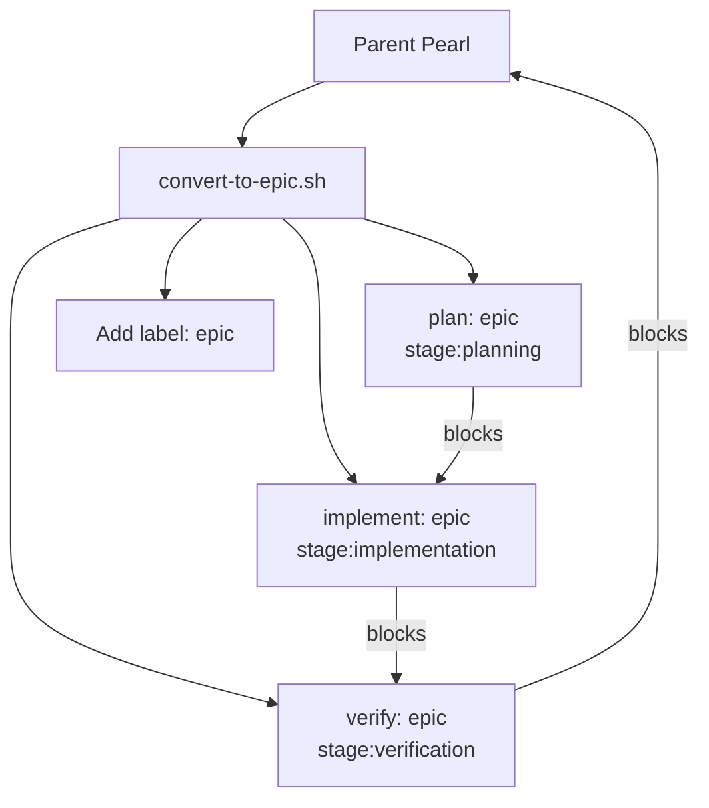
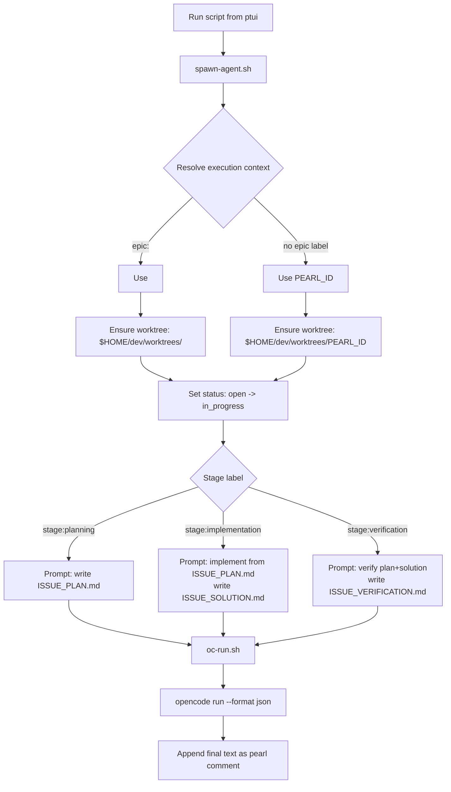

# pearls-bash-ptui

`pearls-bash-ptui` is a lightweight terminal UI for the Pearls issue tracker, built with Bash, `fzf`, and `jq`.

It wraps common `prl` workflows (browse ready/open issues, inspect details, create, update, and run status-gated automation scripts) into a keyboard-driven interface.

## Features

- Repository picker for multi-repo workflows
- Ready queue and open issue views
- Interactive issue detail screen
- In-place update workflow for:
  - Title
  - Priority
  - Status
  - Add/remove labels
  - Description editing via `$EDITOR`
- New issue creation with editor-backed description
- Configurable per-issue actions (`[Run] ...`) filtered by issue status
- Script execution logs with failure-aware viewing
- Tmux Command Center with live session status

## Requirements

Install these commands and make sure they are on `PATH`:

- `prl`
- `jq`
- `fzf`
- `bash`
- `less` (for JSON/log viewing)

Optional (if using bundled automation scripts):

- `git`
- `opencode`
- `tmux` (required for scripts with `run_in_tmux: true` and tmux menu actions)

## Installation

Clone this repository:

```bash
git clone <your-repo-url> pearls-tui
cd pearls-tui
```

Make the main script executable:

```bash
chmod +x ptui.sh
```

(Optional) put it on your PATH:

```bash
ln -s "$PWD/ptui.sh" /usr/local/bin/ptui
```

## Quick Start

Run from a Pearls-enabled repo (or any repo you plan to add to config):

```bash
./ptui.sh
```

On first run, it creates:

- Config dir: `${XDG_CONFIG_HOME:-$HOME/.config}/ptui`
- Config file: `${XDG_CONFIG_HOME:-$HOME/.config}/ptui/config.json`

Default config includes:

- One repo: the current directory (`$PWD` at first launch)
- One sample script action named `Spawn Agent` with `run_in_tmux: false`

## Configuration

Configuration file path:

```text
${XDG_CONFIG_HOME:-$HOME/.config}/ptui/config.json
```

Schema:

- `repos`: array of absolute repo paths
- `terminal_command` (optional): command used when opening a new terminal from `Tmux Command Center`
  - Must be a single-line JSON string
  - Supports `{{TMUX_TARGET}}` placeholder for raw target (for example `ptui-repo-123:prl-45`)
  - Supports `{{TMUX_ATTACH_CMD}}` placeholder for a shell-escaped attach command
- `scripts`: array of script descriptors
  - `name`: menu label
  - `target_status`: one of a specific status (`open`, `in_progress`, `blocked`, `deferred`, `closed`) or `any`
  - `command`: shell command to execute
  - `run_in_tmux` (optional): when `true`, run in tmux (session is per repository, window is per pearl ID) (default `false`)

Example:

```json
{
  "repos": [
    "/Users/me/src/project-a",
    "/Users/me/src/project-b"
  ],
  "terminal_command": "osascript -e 'tell application \"Terminal\" to do script \"{{TMUX_ATTACH_CMD}}\"'",
  "scripts": [
    {
      "name": "Start Agent",
      "target_status": "open",
      "command": "/Users/me/src/pearls-tui/scripts/spawn-agent.sh",
      "run_in_tmux": true
    },
    {
      "name": "Reopen in Triage",
      "target_status": "blocked",
      "command": "prl update \"$PEARL_ID\" --status open",
      "run_in_tmux": false
    },
    {
      "name": "Echo Context",
      "target_status": "any",
      "command": "echo Repo=$REPO_PATH Pearl=$PEARL_ID",
      "run_in_tmux": false
    }
  ]
}
```

### `terminal_command` integration tips

- Keep it on one line in JSON; avoid accidental line breaks inside the string.
- On macOS Terminal.app, prefer `{{TMUX_ATTACH_CMD}}` so quoting stays shell-safe.
- Validate config after editing:

```bash
jq . "${XDG_CONFIG_HOME:-$HOME/.config}/ptui/config.json"
```

## Runtime Environment

### For configured script actions (`[Run] ...`)

When you run a configured action from the issue screen, `ptui` exports:

- `REPO_PATH`: currently selected repository path
- `PEARL_ID`: selected issue ID

Scripts run from `REPO_PATH`.

Execution behavior:

- If `run_in_tmux` is `false` (default):
  - stdout/stderr are streamed live to terminal
  - output is also captured to a temp log file
  - on failure, the log is opened automatically
  - after execution, you can choose to view the full log
- If `run_in_tmux` is `true`:
  - `ptui` starts or reuses a repository-scoped tmux session named `ptui-<repo>-<hash>`
  - `ptui` creates or reuses a pearl-scoped window named `<PEARL_ID>`, then attaches immediately
  - detach with `Ctrl-b d` and reattach later with `tmux attach -t ptui-<repo>-<hash>` and select the pearl window

### For `New Pearl Shell` (Tmux Command Center)

When you create a new pearl shell window, `ptui` starts a login shell with:

- `REPO_PATH` exported to the selected repo path
- `PEARL_ID` exported to the chosen pearl ID

This makes custom shell startup scripts and agent commands immediately pearl-aware.

## Main Menu Flow

1. `Ready Queue`: shows unblocked issues from `prl ready --json`
2. `All Open`: shows open issues from `prl list --status open --json`
3. `Create New Pearl`: prompts title/priority/labels + editor description
4. `Change Repo`: re-open repository picker
5. `Tmux Command Center`: attach to tmux here or open a new terminal attached to repo/selected ptui sessions
6. `Exit`

Issue action menu includes:

- `[Update Pearl]`
- `[View JSON]`
- `[Run] <Script Name>` for matching script rules
- `[Back]`

`Tmux Command Center` supports:

- Live status rows for:
  - Current repo tmux session name and running state
  - Count of existing `ptui-*` sessions
- Attach in the current terminal to the current repo tmux session
- Open a new terminal attached to the current repo tmux session
- Create a new pearl shell window and attach in the current terminal
- Create a new pearl shell window and open it in a new terminal
- Pick any `ptui-*` session/window and attach in the current terminal
- Pick any `ptui-*` session/window and open it in a new terminal
- New-terminal actions use `terminal_command` when configured; otherwise ptui falls back to built-in defaults

If the current repo session does not exist and you choose a current-repo attach/open action, `ptui` now offers a direct create-now flow so you can start a pearl shell and continue immediately.

## Bundled Scripts

Repository includes:

- `scripts/convert-to-epic.sh`
- `scripts/spawn-agent.sh`
- `scripts/remove-worktree.sh`
- `scripts/oc-run.sh`

These scripts form a concrete workflow for Epic decomposition and stage-based execution.

### Script Responsibilities

- `convert-to-epic.sh`
  - Marks the selected pearl as an `epic`
  - Creates 3 linked subtasks labeled:
    - `stage:planning`
    - `stage:implementation`
    - `stage:verification`
  - Links dependencies so stage order is enforced
- `spawn-agent.sh`
  - Resolves an execution context ID:
    - `epic:<id>` label => shared context `<id>`
    - no `epic:` label => context is current `PEARL_ID`
  - Creates/reuses worktree at `$HOME/dev/worktrees/<execution-context-id>`
  - Uses branch `agent/<execution-context-id>`
  - Moves pearl status from `open` to `in_progress` (when applicable)
  - Reads stage label and builds a stage-specific prompt
  - Calls `oc-run.sh` to run OpenCode and log output
- `remove-worktree.sh`
  - Resolves the same execution context ID used by `spawn-agent.sh`
  - Removes worktree for that context
  - Blocks shared-context removal if sibling subtasks with same `epic:<id>` are `in_progress`
  - Allows override with `PTUI_FORCE_REMOVE=1`
  - Moves current pearl status back to `open`
- `oc-run.sh`
  - Runs `opencode run` with JSON output
  - Persists a log file and appends final response text as a pearl comment

### Epic Workflow (3 Subtasks)

`convert-to-epic.sh` turns one parent pearl into an epic plus three stage pearls.



### Stage Execution Flow

`spawn-agent.sh` uses stage labels and an execution context resolver to route work. Subtasks labeled `epic:<id>` share one branch/worktree (`agent/<id>`, `$HOME/dev/worktrees/<id>`).



### Recommended ptui Config for This Workflow

```json
{
  "scripts": [
    {
      "name": "Convert to Epic",
      "target_status": "open",
      "command": "/Users/me/src/pearls-tui/scripts/convert-to-epic.sh",
      "run_in_tmux": false
    },
    {
      "name": "Spawn Agent",
      "target_status": "open",
      "command": "/Users/me/src/pearls-tui/scripts/spawn-agent.sh",
      "run_in_tmux": true
    },
    {
      "name": "Continue Agent",
      "target_status": "in_progress",
      "command": "/Users/me/src/pearls-tui/scripts/spawn-agent.sh",
      "run_in_tmux": true
    },
    {
      "name": "Remove Worktree",
      "target_status": "any",
      "command": "/Users/me/src/pearls-tui/scripts/remove-worktree.sh",
      "run_in_tmux": false
    }
  ]
}
```

### Execution Context Resolution

- If a pearl has exactly one `epic:<id>` label, scripts use `<id>` as the execution context.
- Context determines both branch and worktree:
  - branch: `agent/<context-id>`
  - worktree: `$HOME/dev/worktrees/<context-id>`
- If no `epic:` label exists, scripts use the pearl's own ID, preserving per-pearl behavior for non-epic work.
- If more than one `epic:` label exists, scripts fail fast with an error.

### Notes

- Ensure config `command` paths point to real files on your machine.
- If you use shell paths with `~`, prefer `$HOME` in script variables to avoid literal-tilde path bugs in quoted strings.
- `spawn-agent.sh` intentionally refuses pearls labeled `epic`; run it on stage subtasks.
- `convert-to-epic.sh` expects `prl`, `git`, and `jq` to be available in PATH.

## Troubleshooting

### `Error: '<cmd>' is not installed or not in PATH.`

Install the missing command (`prl`, `jq`, or `fzf`) and re-run.

### No repos shown

Check `config.json` has at least one valid path in `repos`.

### Script appears in menu but fails immediately

- Confirm executable bit: `chmod +x /path/to/script.sh`
- Confirm command path in config is valid
- Confirm script works standalone
- Check failure log path shown after run

### `mktemp` / log file errors while running scripts

Use the current `ptui.sh` from this repository (contains a hardened temp-log creation path and fallback).

### `tmux is required, but it is not installed.`

Install tmux, or avoid tmux-based actions (`run_in_tmux: true` and `Tmux Command Center` terminal actions).

### AppleScript error `Expected string but found end of script` when opening a new terminal

This usually means your `terminal_command` in config contains a broken quoted string or an unintended newline.

Use a single-line value such as:

```json
"terminal_command": "osascript -e 'tell application \"Terminal\" to do script \"{{TMUX_ATTACH_CMD}}\"'"
```

Then validate:

```bash
jq . "${XDG_CONFIG_HOME:-$HOME/.config}/ptui/config.json"
```

### Shared-context worktree removal is blocked

If `remove-worktree.sh` detects sibling subtasks with the same `epic:<id>` in `in_progress`, it blocks removal by default to avoid deleting an active shared worktree.

Override only when intentional:

```bash
PTUI_FORCE_REMOVE=1 /path/to/remove-worktree.sh
```

### `prl` commands fail

Run the same command manually (for example, `prl list --status open --json`) inside the selected repo to confirm Pearls is initialized and healthy.

## Security Considerations

Configured `scripts[].command` values are executed via `eval`.

Treat `config.json` as trusted input only:

- Do not run `ptui` with untrusted config files
- Avoid injecting user-controlled strings into `command` fields

## Development

Useful checks:

```bash
bash -n ptui.sh
shellcheck ptui.sh scripts/*.sh
```

If you submit changes, include before/after behavior notes for:

- issue creation/update paths
- script execution and logging paths
- config compatibility

## License

MIT
